# **SFIA_DevOps_Project 1 – Travel Vaccination Booking App** #

# 1.Introduction of this project

>  This project is to develop a vacation vaccine app which customers can book appointments to gain the vaccines required before they travel. This app attempts to let customers do the following,

1. To **view** the vaccine required the country where the customers travel to,
2. To **C**reate(book) a new appointment
3. To **U**pdate(change) an existing appointment
4. To **R**etrieve and view the appointment history,
5. To **D**elete an existing appointment
6. To Create, Update, Retrieve and Delete user account.

# 2.Kanban Board #

 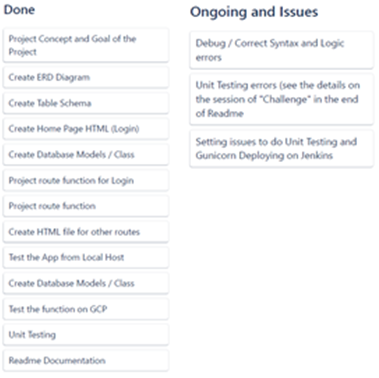

# 3.Goal of this project #
> To create a web app based on MySQL server, Python and Flask that can accept the users’ input/request to create, retrieve, update and delete records in database.

# 4.Structure of the project #
> The structure of this project is shown in the next figure.

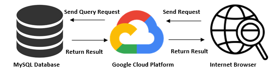

# 5.ER Diagram of the Database #
> This project’s database consists of five tables and their ERD Diagram is shown below: 

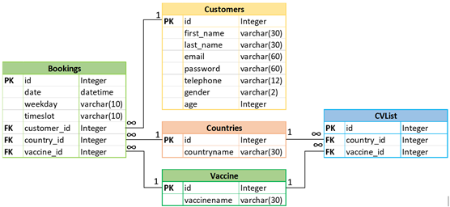

> The tables used in this projects are defined in table_list.py as following:

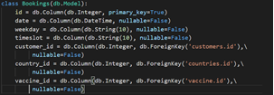

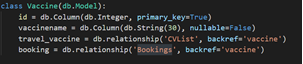
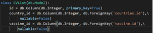

# 6.App Interface #
> Web interface includes the following 6 HTML files,

## 6-1.Login page:  ##

> This page is for user to login. Users provide their registered email address and password to login.
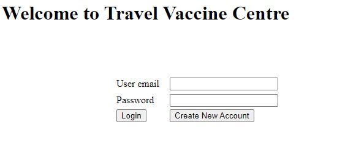

> **For a new user**: new users need to create user account before they can use the services.
## 6-2.Signup page: ##

> for new users, they can register and create their accounts in this page.
> 
## 6-3. Update page: ##

> Users can update their accounts details in this page.
> 
## 6-4. Actions page: ##

> Once the registered users login successfully, they will be directed to actions page which enables them to,

- Update their register account details.
- Make a vaccine appointment
- Logout

## 6-5. Booking page:  ##

> The page is the key component of this project. In this page, users can

- **C**reate a new appointment.
- **R**etrieve their appointment records.
- **U**pdate an existing appointment. Users will be redirected to another URL to view the selected appointment details, before they change and update the record. 
- **D**elete an existing appointment.

## 6-6. Updatebooking ##

> This page allows user to

- View the selected appointment details, change the appointment and update the appointment.  and 
- Cancel the action of updating the appointment, if they change their minds.

> Each URL corresponds to one route with the same name of the html file, except login (for 'home' or '\').
The workflow of above can be depicted by the next figure,

> 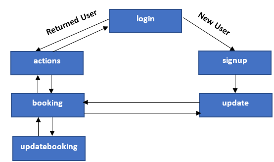

# 7.Project folder_structure #
The folder structure of this project is as following,
> 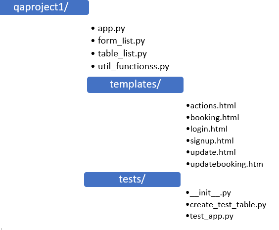

# 8.Route function #
## 8-1. login ##
> Login and Create New Account are the main functions of this page.
#### What it does ####
> 
- Validate if email address format is correct
- Validate if user is a registered or new user
- Redirect registered users to actions page with successful login
- Redirect new users to signup page and auto fill email field if the email is in correct format
#### What it cannot do ####
> 
- If a returned user input his/her email address and click Create New Account, the user will be redirected to signup page. But the user won’t be able to create a new account using an existing email.
- No changing passwords function if user forget their passwords.

## 8-2. Actions ##
> This page has three buttons. Each button will redirect users to different pages.
#### What it does ####
> 
- Update Your Account
- Manage Your Appointments
- Log out
This page also displays all the appointment booked by a user if any.
#### What it cannot do ####
> 
- NA
## 8-3. Booking ##
> This page allows users to manage their appointments by viewing the appointments, creating a new appoint, deleting and updating an existing appointment.
#### What it does ####
> 
- Create an Appointment: A new appointment can be created by the following steps: 1.Users select the country where they travel to. 2.Click Retrieve Vaccine button to populate the vaccine drop-down list with vaccine associated to the selected country. 3. Select the vaccine. 4. Select the date. The selected date must be a working day (Monday to Friday) and later than today. 5. Select the time slot. If any of selections is incorrect, there will be an error message to ask users to reselect.
- Delete a selected Appointment
- Update a selected Appointment which will redirect users to another web page.
- When delete or update an existing appointment, if no appointment is selected, an error message will show.
- An appointment list will be updated to reflect users' actions.

#### What it cannot do ####
> 
- Ideally, the appointments should be seen in different status, such as expired, executed and to be fulfilled. But at this moment all the appointments will be treated as same.
- Further, the users should be able to click the appointment they want to view or change by clicking the appointment directly. But at this moment, there are some undergone process to follow.
- In addition, when the country is selected, the vaccine drop-down menu should automatically populate. Now it requires to retrieve vaccine button to trigger the change.

## 8-4. Updatebooking  ##
> This is similar to the process to Create an Appointment in Booking. The difference is the country, vaccine, date and time slot is based on the selected booked record.
#### What it does ####
> Users can change what they would like to change by clicking the buttons
- Update this Appointment: to update the appointment 
- Cancel, if they change their minds.
- Both buttons will redirect them back to booking page. A message in booking page will also show how the appointment has been updated.
#### What it cannot do ####
> 
- It could be more user friendly by clicking the appointment list.
## 8-5. Signup ##
> This page is for the new users to create their account before they can make a vaccine appointment. 
#### What it does ####
> All the field are required (i.e cannot be null).  
- Validates email format,
- Validate length of the password (6 to 25 characters)
- Validate if password is same as the re-type password 
- If the email exits in the database, the users will be redirected back to login page
#### What it cannot do ####
> 
- It cannot check and advise if the password is strong or weak.- 
## 8-6. Update ##
> This page allows users to manage their accounts (not appointments).
#### What it does ####
- Update your Account, change the all the account information except password.
- Delete your Account, users can only delete their accounts if they don’t have appointments. If they do, they cannot delete their accounts. and
- Make an Appointment: redirect to booking page 
#### What it cannot do ####
> 
- Users cannot change their passwords

# 9. Unittest Results #
Local coverage test result(16 tests, coverage = 65%).

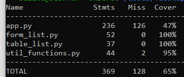

# 10.Deploy process (CI) #
> The code is created, developed, and tested in a local git repo.

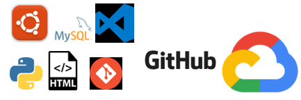

- Git is used to control the revision of the codes through the development process.
- Working environment: UBUNTU environment (20.04) by WSL(Window Subsystem Linux).
- Database: MySQL server is installed.
- Programming language: Python 3.6
- Host: Goggle Cloud Platform

Each commit of the codes was pushed to git hub.
The project in Git Hub will be fetched to GCP instance to test if the app can be accessed from Internet.

# 11.Developing process #
- The project starts from a simplified table which has only three attributes. Use this table to learn how to use HTML form, FLASK and SQLAlchemy. 
- Learn how to use form to receive the client’s request and data and use Flask to perform the corresponding actions to the request and display the execution result
- After I have a better understanding of this framework, more complicated relational tables.
- Develop codes to response to all the requests.
- Test the codes.

# 12. Challenges #
> There are several challenges while developing this project,

1. Environment: There are setup issues in many occasions. For example, UBUNTU revisions between the local PC and GCP instance are different. Different versions of UBUNTU have different setups which are unique and not compatible. It would be great if there is a recommended setup at the very beginning of the training.
1. Rational database with foreign key. It took me some time to figure out the naming of backreef in db.Relational function.
1. There are variables passed between different routes. In the beginning I use session[‘variable’] to pass the variables. They work but also result in some problems, especially in performing pytest. Thanks for Luck’s suggestion to use dynamic URL.
1. DateTime comparison. As mention above when the users make an appointment, they need to select a future working day. To make this work, the selected date is compared to the current day (today). Due to the date format, the comparison is not  straightforward. Eventually, the dates were converted to an integer for the comparison purpose.
1. Another datetime issue rises when I run Pytest. I have to change the code to in Pytest
      bookings.date= datetime.now()

#### for pytest ####
- When I use session[‘var’] to pass the variable between routes, pytest returns error, something like KeyError: id. I suspect that is caused by session variable.
- Luke suggested me to use Dynamic URL. Then I pass the variable by using ‘url/<email>/<id>’. I use the following code to perform test, 
>
    self.client.post(
     	url_for('signup'),
        data = dict(email ="John.doe@company.com"),
        follow_redirects=True
    ) 

This code works.

# 13. Author #
## Sabina Ku ##

 

	

    
